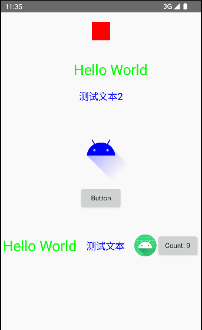

## Compose for Android View

使用Compose Runtime/Compiler 和Android View来创建简单的React UI framework. 
没有使用Compose的UI/Foundation/Material的模块.
可以自行定义任何Android的widgets，不需要转向Compose的View体系，目前已基于LinearLayout实现Row/Column；基础组件View/Image/Text。

理论上可以接入其他任意UI框架，接了Agil，可以跑个Demo
